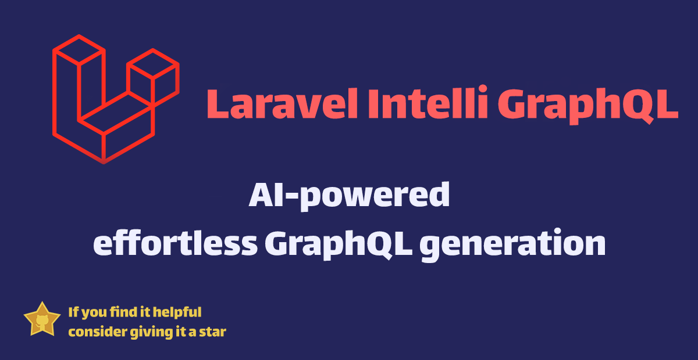

# Laravel IntelliGraphQL Package

[](https://packagist.org/packages/salehhashemi/laravel-intelli-graphql)
[](https://packagist.org/packages/salehhashemi/laravel-intelli-graphql)
[](https://github.com/salehhashemi1992/laravel-intelli-graphql/actions/workflows/run-tests.yml)
[](https://github.styleci.io/repos/636363137?branch=main)

The Laravel IntelliGraphQL package is an AI-driven Laravel package for generating GraphQL schemas, queries, and mutations based on a given database table.



## Installation

1. Install the package via composer:
    ```
    composer require salehhashemi/laravel-intelli-graphql
    ```

2. Publish the configuration file:
    ```
    php artisan vendor:publish --provider="Salehhashemi\LaravelIntelliGraphql\LaravelIntelliGraphqlServiceProvider"
    ```

3. Add your OpenAI API key to the `.env` file:
    ```
    OPEN_AI_KEY=your_openai_key
    ```

4. Optionally, you can change the default model used by OpenAI in the `.env` file:
    ```
   OPEN_AI_MODEL=gpt-4
    ```

## Usage

To use the Laravel IntelliGraphQL package, you can use the ai:graphql command in your terminal, providing the name of the database table as an argument:

```
php artisan ai:graphql {table}
```

Replace {table} with the name of the table for which you wish to generate the GraphQL schema, queries, and mutations.

For example:

```
php artisan ai:graphql users
```

This command will generate a GraphQL schema, queries, and mutations for the users table, and will place them in a file called users.graphql within the graphql directory at the root of your Laravel project.

The generated GraphQL schema, queries, and mutations will include all the columns within the provided table. The AI model uses this information to intelligently generate the appropriate GraphQL schema, queries, and mutations.

## Examples

Assume you have a table named users with the following columns: id, name, email, email_verified_at, password, remember_token, created_at, updated_at.

Running the command php artisan ai:graphql users will generate a users.graphql file in the graphql directory at the root of your Laravel project. The content might look something like this:

```
type User {
  id: ID!
  name: String!
  email: String!
  emailVerifiedAt: DateTime
  password: String!
  rememberToken: String
  createdAt: DateTime!
  updatedAt: DateTime!
}

type Query {
  users: [User!]!
  user(id: ID!): User
}

type Mutation {
  createUser(name: String!, email: String!, password: String!): User!
  updateUser(id: ID!, name: String, email: String, password: String): User
  deleteUser(id: ID!): User
}
```

### Testing

```bash
composer test
```

### Changelog

Please see [CHANGELOG](CHANGELOG.md) for more information what has changed recently.

## Contributing

Please see [CONTRIBUTING](CONTRIBUTING.md) for details.

## Credits

- [Saleh Hashemi](https://github.com/salehhashemi1992)
- [All Contributors](../../contributors)

## License

The MIT License (MIT). Please see [License File](LICENSE.md) for more information.